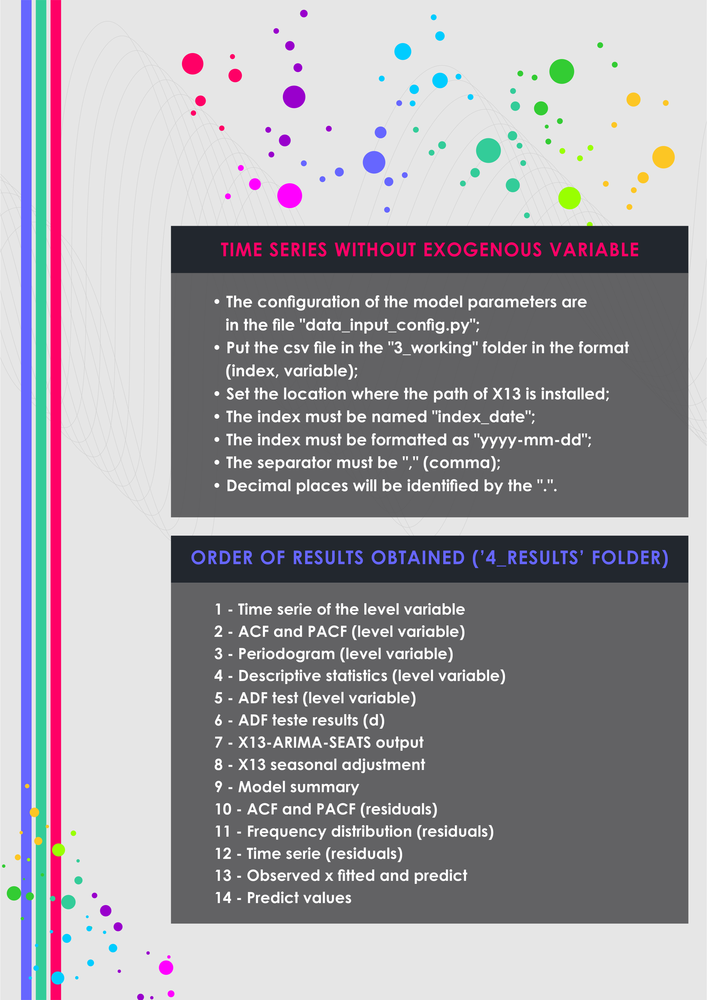    

# **EXAMPLE OF RESULTS:**

# **DESCRIPTION**
Electricity in Brazil is provided through a matrix that is composed of renewable and non-renewable energies. Renewables have their resources found in nature and these are inexhaustible while non-renewables are exhaustible. Thus, the Brazilian energy matrix is ​​composed of hydraulic, wind, solar and thermal plants, which are: gas, coal, oil, nuclear, biomass and others. Biomass, from thermal plants, is the only renewable one. Eletrobras is responsible for promoting studies, projects for the construction and operation of generation plants, transmission lines and distribution of electric energy, as well as the execution of commercial acts arising from these activities, such as the sale of electric energy. Consumption is given by the individual or legal entity, responsible for a consumer unit or set of consumer units gathered by de facto or de jure community, legally represented, and which, at the same time, are located in contiguous areas, can be served through a single delivery point and whose measurement is also unique. This class of industrial consumption is characterized by the supply to the consumer unit in which industrial activity is developed, as defined in the National Classification of Economic Activities - CNAE, as well as the transport of raw material, input or product resulting from its processing, characterized as support activity and without its own economic purpose, as long as it is physically integrated with the industrial consumer unit.

Source: https://www.eletrobras.com

# **RESULTS**
Results obtained through the model estimation process.

## Variable analysis at level:
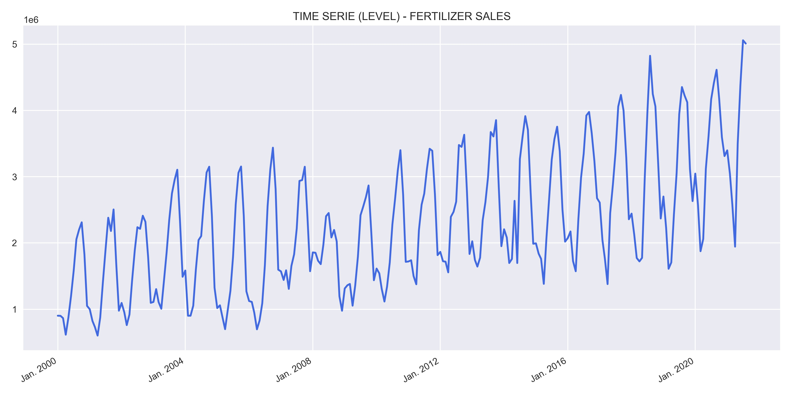    

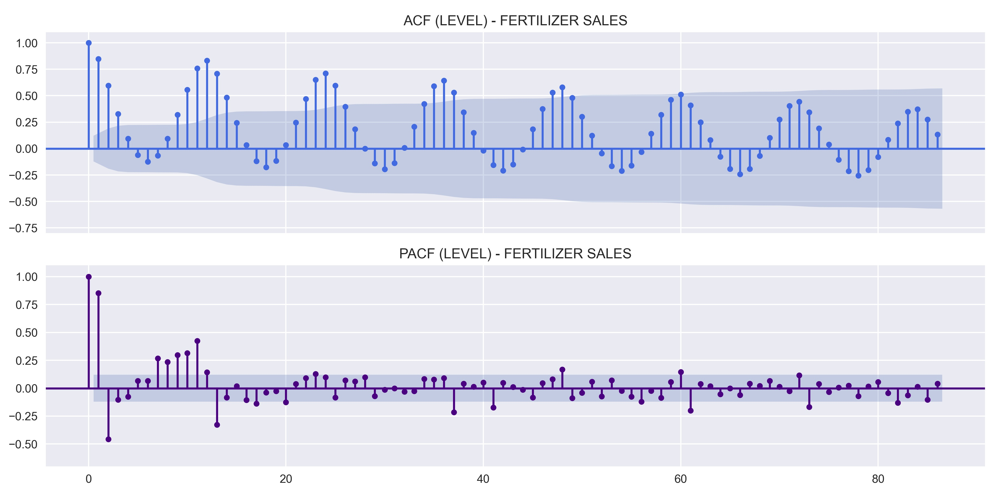    

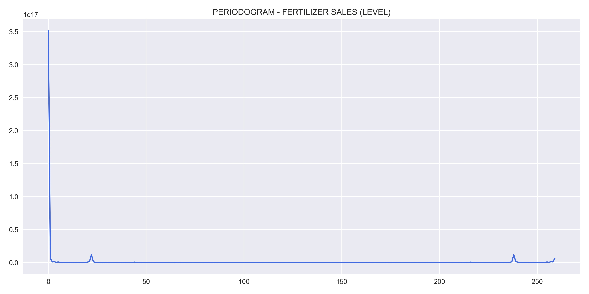    

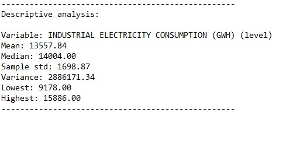    

## Study of data stationarity:
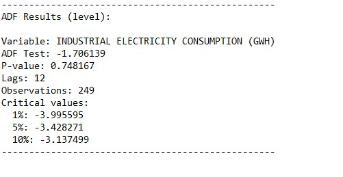    

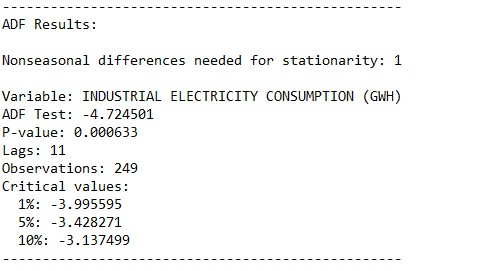    

## SEASONAL ADJUSTMENT:
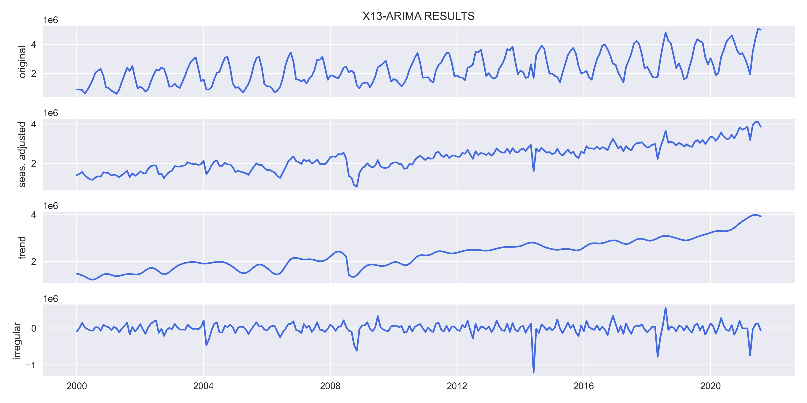    

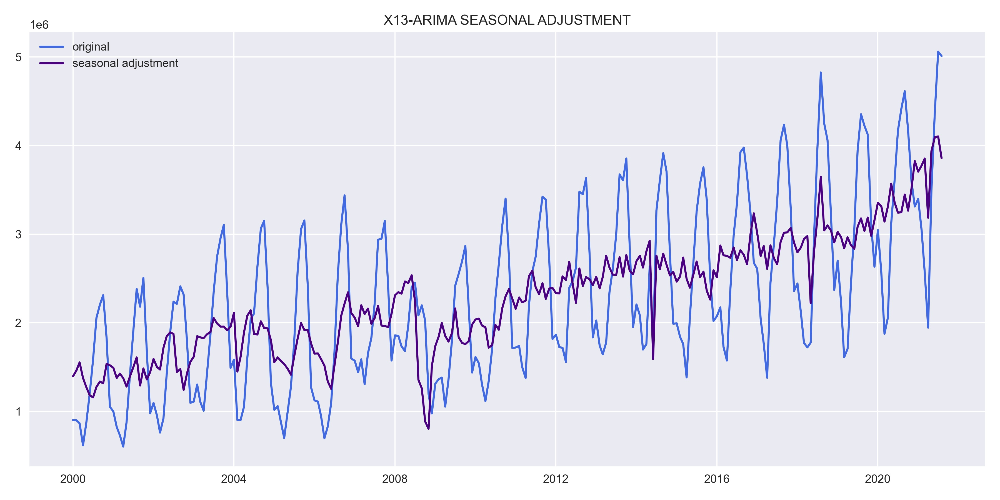    

## Model results:
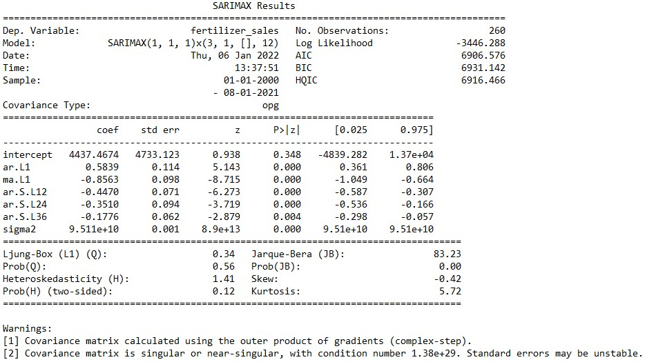    

## Residual analysis:
    

    

    

# FORECAST:
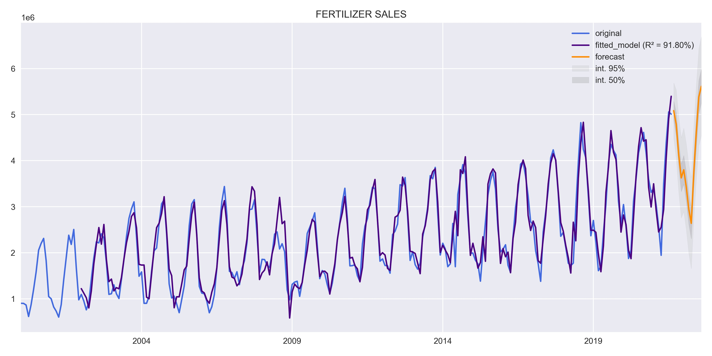    
